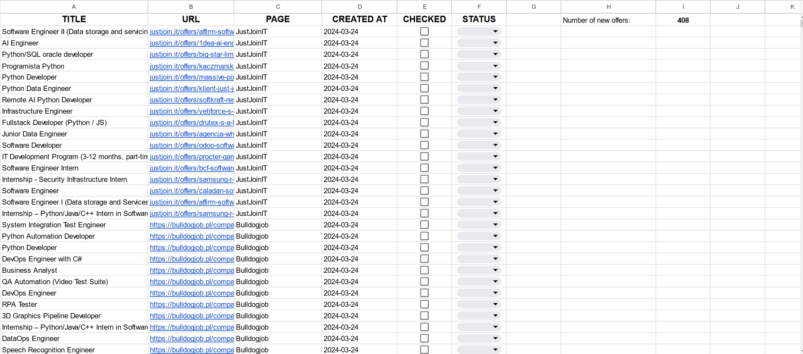
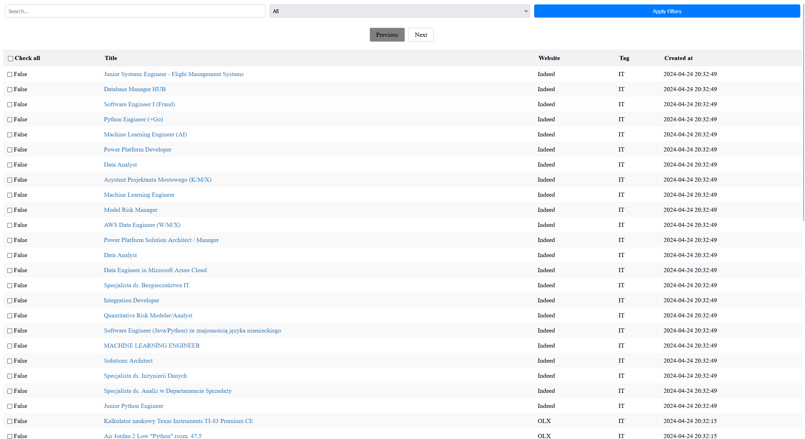

[![Contributors][contributors-shield]][contributors-url]
[![Forks][forks-shield]][forks-url]
[![Stargazers][stars-shield]][stars-url]
[![Issues][issues-shield]][issues-url]
[![MIT License][license-shield]][license-url]
[![LinkedIn][linkedin-shield]][linkedin-url]


<br />
<div align="center">
  <h3 align="center">Job scraper</h3>

  <p align="center">
    A program that allows you to scrape job offers from many websites and save new offers in Google Sheet, .XLSX file or SQLite database with local web application server support
    <br />
    <br />
    <a href="https://github.com/DEENUU1/tvtime-scraper/issues">Report Bug</a>
    ·
    <a href="https://github.com/DEENUU1/tvtime-scraper/issues">Request Feature</a>
  </p>
</div>




## Features

1. **Multi-Portal Job Scraper:**
   - The project is designed to scrape job postings from various job portals.
   - Implements the Strategy Pattern for scrapers, allowing flexibility in choosing the scraping method based on the website's structure.
   - Utilizes either requests + BeautifulSoup or Selenium, with Selenium capable of scrolling pages and handling pop-up windows.

2. **Data Management and Multi storage options:**
   - Scraped data is efficiently stored to prevent duplication.
   - The application allows you to save data to Google Sheet, an .XLSX file or an SQLite database.
By selecting the SQLite database, you can run a local server written in FastAPI to browse and filter the saved data

3. **Customizable Scraping Parameters:**
   - Users can set specific links for supported job portals along with filters and sorting preferences for tailored scraping.
   - Time-based Filtering:
   - Provides an option to set a maximum age for job postings, preventing the scraping of listings older than the specified timeframe (e.g., not scraping job postings older than 3 days).

4. **Flexible Configuration:**
   - Users can configure the scraper to their preferences, enabling selective scraping based on categories or other criteria specified by the user.

5. **Automated Maintenance:**
   - The application handles cookie consent pop-ups automatically, ensuring uninterrupted scraping experience.

## Supported websites and url configuration

### !INFO! 
I recommend that each link comes from the first page (pagination) and that it complies with the recommendations below. I have provided examples of correct and incorrect links for each page

<details>
<summary><a href="https://bulldogjob.pl/">bulldogjob</a></summary>

```
# bulldogjob.pl url must ends with "/page,"

https://bulldogjob.pl/companies/jobs/page,  # valid
https://bulldogjob.pl/companies/jobs/s/skills,Python,JavaScript/page, #valid

https://bulldogjob.pl/companies/jobs/s/skills,Python,JavaScript # invalid
```

</details>

<details>
<summary><a href="https://pl.indeed.com/?from=gnav-jobsearch--indeedmobile">indeed</a></summary>

```
# indeed.com url have to include some parameters

https://pl.indeed.com/jobs?q=&l=Warszawa%2C+mazowieckie&from=searchOnHP&vjk=1593bca04b48ed8a # valid (choose Warsaw as a location)

https://pl.indeed.com/ # invalid

```

</details>
<details>
<summary><a href="https://it.pracuj.pl/praca">it.pracuj.pl</a></summary>

```
https://it.pracuj.pl/praca # valid
https://it.pracuj.pl/praca?itth=50%2C75 # valid
```

</details>
<details>
<summary><a href="https://pl.jooble.org/SearchResult">jooble</a></summary>

```
# Here you need to add some filters on the website, then copy url and scroll few times
# and then change `?p=` value to for example 10000 

https://pl.jooble.org/SearchResult?p=10000&rgns=Warszawa # valid
https://pl.jooble.org/SearchResult?rgns=Warszawa # invalid

```

</details>
<details>
<summary><a href="https://nofluffjobs.com/pl">nofluffjobs</a></summary>

```
https://nofluffjobs.com/pl # valid
https://nofluffjobs.com/pl/.NET?page=1&criteria=seniority%3Dtrainee,junior # valid
```

If script looped, please check this issue https://github.com/DEENUU1/job-scraper/issues/2

</details>
<details>
<summary><a href="https://www.olx.pl/praca/">olx</a></summary>

```
# Scraping data from OLX is a little more difficult
# First you need to go to https://www.olx.pl/praca/ and choose all filters that you need 
# Then click the right mouse button and go to Devtools
# Go to Network tab and refresh the page
# Scroll to the end and go to page 2 (pagination)
# Scroll to the end again and now in the Network tab search for a JSON with url like this "https://www.olx.pl/api/v1/offers/?offset=40&...."
# In my example it looks like this https://www.olx.pl/api/v1/offers/?offset=40&limit=40&category_id=4&filter_refiners=spell_checker&sl=18c34ade124x23bc10a5
# Then click links and go to previous 
# Cope this link from your browser and add to config.json file
```

</details>
<details>
<summary><a href="https://theprotocol.it/filtry/java;t/trainee,assistant;p">theprotocol</a></summary>

```
https://theprotocol.it/filtry/java;t/trainee,assistant;p # valid
https://theprotocol.it/praca # valid 
```

</details>
<details>
<summary><a href="https://useme.com/pl/jobs/category/programowanie-i-it,35/">useme</a></summary>

```
https://useme.com/pl/jobs/category/programowanie-i-it,35/ # valid
https://useme.com/pl/jobs/category/multimedia,36/ # valid
https://useme.com/pl/jobs/category/serwisy-internetowe,34/ # valid
https://useme.com/pl/jobs/category/serwisy-internetowe,34/sklepy-internetowe,97/ # valid
```

</details>


## Technologies:
- Python
  - Requests
  - BeautifulSoup4
  - Selenium
  - FastAPI
- Docker 
- Google Sheet
- Powershell
- SQLite
- Javascript
- HTML & CSS

## Installation

#### Clone repository
```bash
git clone https://github.com/DEENUU1/job-scraper.git
```

#### Set up your Google Account (you can skip this part if you want to save data locally in .xlsx file or in SQLite database)
1. Go to <a href="https://console.cloud.google.com/welcome?project=private-418116">Google Console</a>
2. Create or choose existing project <a href="https://developers.google.com/workspace/guides/create-project?hl=pl">Tutorial</a>
3. Go to Navigation Menu and select APIs & Services and then Credentials
4. Click CREATE CREDENTIALS and choose Service Account
5. Give some random name and click Done
6. Copy e-mail of the created account
7. Then click on the pencil button to the left of the trash icon
8. Go to Keys and click ADD KEY and then Create new key
9. Choose JSON format and then Create 
10. Rename downloaded file to `credentials.json` and copy it to the main direction of this project (the same directory where main.py is located)
11. <a href="https://console.cloud.google.com/marketplace/product/google/sheets.googleapis.com?q=search&referrer=search&project=private-418116" >Go back to Google Console and search for Google Seet API</a>
12. Enable this API
13. Create new Google Sheet 
14. In Google Sheet click on Share and copy here the email you copied earlier
15. Choose access for all people with link and copy this link
16. Add link to `config.json` in field `url`

#### Config set up
- `url` is dedicated for Google Sheet 
- `keywords_to_pass` List of keywords after which offers are to be skipped
- `export_type` Here you can type "excel", "googlesheet" or "db" if you choose "excel" data will be saved locally in .xlsx file, if you want to save data in Google Sheet choose "googlesheet" and if you want to use SQLite database + local web application to browse and filter data choose "db"
- `max_offer_duration_days` you can set here null or some integer number (for example 5) If the value is an integer, offers downloaded from websites will not be older than the number of days you specify
- `websites` here you can add multiple urls from which you want to scrape job offers, each website can have tag (string) to facilitate subsequent filtering of offers.
```json
    {
      "url": "https://pl.indeed.com/praca?l=Zdu%C5%84ska+Wola%2C+%C5%82%C3%B3dzkie&radius=10&sort=date&vjk=adc0ec0fd20bd577",
      "tag": "Zduńska Wola"
    },
    {
      "url": "https://pl.indeed.com/jobs?q=python&sort=date&fromage=3&vjk=a986e0ad45696cf8",
      "tag": "IT"
    },
```

#### `urls_to_skip.txt` set up **(Optional)**
Here you can add links for job offers that should be skipped and not added to your Google Sheet document
<br>
It should looks like this, each url in new line. 
```txt
https://www.pracuj.pl/praca/konsultant-wdrozeniowiec-systemu-obiegu-dokumentow-warszawa-poloneza-93,oferta,1003226213?s=4a77b1b9&searchId=MTcxMTM3NTM0NDY5NS4yNjcz
https://www.pracuj.pl/praca/mlodszy-analityk-biznesowy-warszawa-dzielna-60,oferta,1003211869?s=4a77b1b9&searchId=MTcxMTM3NTM0NDY5NS4yNjcz
https://www.pracuj.pl/praca/junior-devops-engineer-z-chmura-gcp-warszawa,oferta,1003220296?s=4a77b1b9&searchId=MTcxMTM3NTM0NDY5NS4yNjcz
```

### Without docker
#### Install requirements
```bash
pip install -r requirements.txt
```

#### Migrations (Optional)
If you choose "db" as an export type apply migrations
```bash
alembic upgrade head
```

#### Run scrapers
```bash
python main.py

# On windows you can run `run.ps1` powershell script
```

#### If you set "db" in your config file you can run local server
```bash
python server.py

# On windows you can run 'server.ps1' powershell script
```

### With docker
**I don't recommend to use Docker if you decided to save your data to SQLite. 
I still need to refine this option, but for now I recommend using Docker in combination with Google Sheet or .XLSX files**
#### Build image
```bash
docker build -t scraper .
```

#### Run scrapers
```bash
docker run scraper
```


## Authors

- [@DEENUU1](https://www.github.com/DEENUU1)

<!-- LICENSE -->

## License

See `LICENSE.txt` for more information.


<!-- MARKDOWN LINKS & IMAGES -->
<!-- https://www.markdownguide.org/basic-syntax/#reference-style-links -->

[contributors-shield]: https://img.shields.io/github/contributors/DEENUU1/job-scraper.svg?style=for-the-badge

[contributors-url]: https://github.com/DEENUU1/job-scraper/graphs/contributors

[forks-shield]: https://img.shields.io/github/forks/DEENUU1/job-scraper.svg?style=for-the-badge

[forks-url]: https://github.com/DEENUU1/job-scraper/network/members

[stars-shield]: https://img.shields.io/github/stars/DEENUU1/job-scraper.svg?style=for-the-badge

[stars-url]: https://github.com/DEENUU1/job-scraper/stargazers

[issues-shield]: https://img.shields.io/github/issues/DEENUU1/job-scraper.svg?style=for-the-badge

[issues-url]: https://github.com/DEENUU1/job-scraper/issues

[license-shield]: https://img.shields.io/github/license/DEENUU1/job-scraper.svg?style=for-the-badge

[license-url]: https://github.com/DEENUU1/job-scraper/blob/master/LICENSE.txt

[linkedin-shield]: https://img.shields.io/badge/-LinkedIn-black.svg?style=for-the-badge&logo=linkedin&colorB=555

[linkedin-url]: https://linkedin.com/in/kacper-wlodarczyk

[basic]: https://github.com/DEENUU1/job-scraper/blob/main/assets/v1_2/basic.gif?raw=true

[full]: https://github.com/DEENUU1/job-scraper/blob/main/assets/v1_2/full.gif?raw=true

[search]: https://github.com/DEENUU1/job-scraper/blob/main/assets/v1_2/search.gif?raw=true
